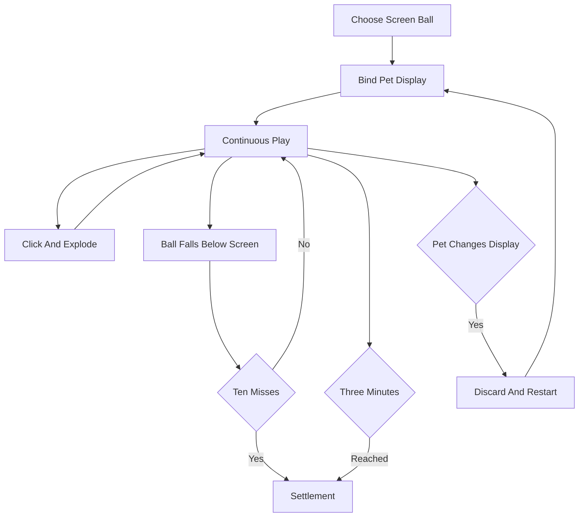
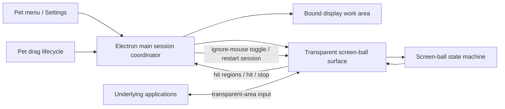
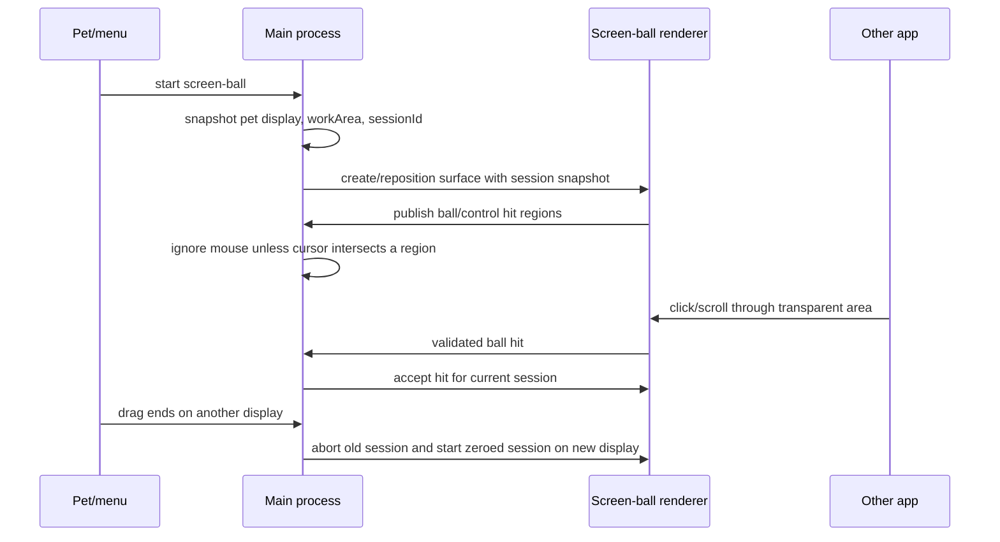

# ButlerBuddy Screen Ball - Plan

## Goal Capsule

- **Objective:** 新增一个简单、休闲、以手速为核心的全屏弹球游戏，让 ButlerBuddy 在宠物所在显示器发射小球，用户点击爆破得分。
- **Product authority:** 本文定义用户已确认的产品行为；现有小窗弹球游戏保持不变，具体实现方式由后续规划决定。
- **Open blockers:** 无。

---

## Product Contract

### Summary

新增“全屏弹球”作为与现有小窗娱乐同级的独立游戏。
ButlerBuddy 持续在所在显示器发射最多三颗小球，玩家一边正常使用其他应用，一边快速点击爆破并争取高分。

### Problem Frame

现有弹球娱乐被限制在宠物附近的小窗口，角色、目标和计分信息容易争夺同一块空间。
新的游戏需要发挥桌面宠物跨应用存在的特点，同时避免把全屏体验做成复杂或持续打扰工作的街机模式。

### Key Decisions

- **新增同级游戏而非替换现有玩法。** (session-settled: user-directed — chosen over replacing the mini-window game: the user wants both games to remain available.) Governs R1.
- **采用连续追球。** (session-settled: user-directed — chosen over wave and survival modes: continuous play best preserves a simple, casual feel.) Governs R3, R10, R12.
- **每局绑定宠物所在显示器。** (session-settled: user-directed — chosen over cross-display travel: balls should stay with the pet's current screen.) Governs R2, R4, R9.
- **使用双结束条件。** (session-settled: user-approved — chosen over miss-only ending: a three-minute cap prevents skilled players from creating endless sessions.) Governs R5.
- **桌面操作优先保持可用。** (session-settled: user-approved — chosen over a modal full-screen game: only the balls should consume pointer input.) Governs R7, R8.

<!-- ce-section: work-relationships -->
### How This Work Fits Together

本文只负责新的全屏弹球游戏，并把它作为 ButlerBuddy 娱乐菜单中的一个独立选项。

- **Can proceed independently of:** 现有小窗弹球玩法继续保留，不要求本计划同步重做。
- **Shares:** 宠物发射动作、弹球视觉资产、娱乐入口和偏好体系可继续作为统一体验的一部分。
- **Enables:** 后续可以另行探索更多全屏小游戏，但这些候选玩法不是本计划承诺的路线图。

### Actors

- A1. **玩家:** 主动开启游戏，点击小球，继续操作桌面应用，并随时结束游戏。
- A2. **ButlerBuddy:** 发射和补充小球，呈现爆破反馈，记录得分、连击、反应时间和丢失次数。

### Requirements

**Game selection and lifecycle**

- R1. “全屏弹球”必须作为与现有小窗弹球同级的独立游戏入口出现。
- R2. 每局开始时必须绑定 ButlerBuddy 当前所在显示器的可用工作区。
- R3. ButlerBuddy 必须连续发射和补充小球，并确保屏幕上同时最多存在三颗。
- R4. ButlerBuddy 在游戏中被拖到另一显示器时，旧局必须被放弃，并在新显示器从零开始新局。
- R5. 一局必须在累计丢失十颗小球或经过一百八十秒时结束，以先发生者为准。
- R6. 玩家必须能在任意时刻主动结束游戏，且结束后不再保留飞行中的小球。

**Desktop interaction and ball behavior**

- R7. 除小球自身外，游戏的所有透明区域必须让指针输入穿透，以便玩家继续操作其他应用。
- R8. 小球覆盖下层应用控件时，点击必须优先击破小球，而不是触发下层控件。
- R9. 小球必须在显示器左侧、右侧和顶部边缘反弹，并在落出底部时记为一次丢失。
- R10. 玩家点击有效小球后，小球必须立即爆破并从屏幕移除，随后继续补球。

**Scoring and settlement**

- R11. 单球得分必须以从发射到点击的反应时间为主要依据，点击越快得分越高。
- R12. 连续快速击破必须形成连击反馈，使持续手速成为总分差异的第二来源。
- R13. 结算必须显示总分、平均反应时间、最高连击和丢失数量。
- R14. 玩家坚持满一百八十秒时必须获得“完美收工”完成状态，但该状态不得额外改变分数。

### Key Flows

- F1. **Start a round**
  - **Actors:** A1, A2
  - **Steps:** 玩家选择全屏弹球；游戏绑定宠物所在显示器；ButlerBuddy 发射第一颗球并持续补充。
  - **Outcome:** 当前显示器进入最多三球的连续追球状态。
  - **Covers:** R1, R2, R3.
- F2. **Hit a ball**
  - **Actors:** A1, A2
  - **Steps:** 玩家点击小球；小球爆破；游戏计算反应分和连击；ButlerBuddy 补充新球。
  - **Outcome:** 玩家获得即时反馈，桌面其他区域继续可操作。
  - **Covers:** R7, R8, R10, R11, R12.
- F3. **Lose a ball and finish**
  - **Actors:** A1, A2
  - **Steps:** 小球落出屏幕底部；丢失数增加；达到十次或一百八十秒时进入结算。
  - **Outcome:** 游戏清除剩余小球并显示本局结果。
  - **Covers:** R5, R9, R13, R14.
- F4. **Move to another display**
  - **Actors:** A1, A2
  - **Steps:** 玩家将 ButlerBuddy 拖到另一显示器；游戏放弃旧局；新显示器从零开始。
  - **Outcome:** 小球始终只属于宠物当前所在显示器。
  - **Covers:** R2, R4.
- F5. **Stop voluntarily**
  - **Actors:** A1, A2
  - **Steps:** 玩家主动结束游戏；当前小球被清除；ButlerBuddy 返回普通桌宠状态。
  - **Outcome:** 游戏不会在退出后继续占用桌面。
  - **Covers:** R6.

### Acceptance Examples

- AE1. **Ordinary desktop interaction**
  - **Covers R7.**
  - **Given:** 全屏弹球正在运行，指针位于没有小球的桌面区域。
  - **When:** 玩家点击、滚动或操作下层应用。
  - **Then:** 输入直接到达下层应用，游戏不抢占该操作。
- AE2. **Ball overlaps another control**
  - **Covers R8, R10.**
  - **Given:** 一颗小球位于下层应用按钮上方。
  - **When:** 玩家点击小球。
  - **Then:** 小球爆破并得分，下层按钮不触发。
- AE3. **Three-ball cap**
  - **Covers R3.**
  - **Given:** 屏幕上已有三颗有效小球。
  - **When:** 到达下一次发射时机。
  - **Then:** ButlerBuddy 等待空位，不产生第四颗球。
- AE4. **Miss limit**
  - **Covers R5, R9, R13.**
  - **Given:** 玩家已经丢失九颗小球。
  - **When:** 下一颗小球落出显示器底部。
  - **Then:** 游戏立即结束并显示包含十次丢失的结算结果。
- AE5. **Time limit**
  - **Covers R5, R13, R14.**
  - **Given:** 玩家尚未丢失十颗小球。
  - **When:** 本局达到一百八十秒。
  - **Then:** 游戏以“完美收工”状态结算，分数只来自本局击破表现。
- AE6. **Display change**
  - **Covers R2, R4.**
  - **Given:** 游戏正在第一台显示器运行。
  - **When:** 玩家把 ButlerBuddy 拖到第二台显示器。
  - **Then:** 第一台显示器的小球全部消失，第二台显示器开始一局零分新游戏。
- AE7. **Voluntary exit**
  - **Covers R6.**
  - **Given:** 游戏仍有飞行中的小球。
  - **When:** 玩家主动结束游戏。
  - **Then:** 所有小球立即消失，桌面不再保留游戏交互区域。

### Success Criteria

- 新玩家只需理解“点击球、别让球掉到底部”即可开始游戏。
- 正常桌面输入在小球命中区域之外保持可用。
- 任意一局不会因为玩家零失误而超过三分钟。
- 更短的平均反应时间和更稳定的连续击破能产生更高总分。

### Scope Boundaries

**Deferred for later**

- Boss、道具、颜色匹配和连锁爆破规则。
- 波次模式、生存加速模式和跨显示器飞行。
- 暂停后续玩、旧屏分数继承和跨局进度。
- 持久排行榜、长期奖励和更多全屏小游戏。

**Outside this work**

- 替换或重做现有小窗弹球游戏。
- 把桌面变成阻断其他应用操作的模态游戏空间。

### Dependencies and Assumptions

- 当前桌宠运行环境能够识别宠物所在显示器，并支持透明、置顶和非聚焦窗口行为。
- 游戏只在玩家明确选择后启动，不会作为常驻桌面动画自动运行。
- 发射间隔、球速、重力、反弹幅度和点击目标尺寸属于后续规划与试玩调优范围。
- 各桌面平台对透明交互窗口的限制可能不同，规划阶段必须验证一致的玩家体验。

### Outstanding Questions

**Deferred to Planning**

- 单球反应分的区间和衰减曲线。
- 连击的时间窗口、展示强度和中断条件。
- 不同阶段的发射间隔、速度范围和难度节奏。
- 爆破视觉、音效和可关闭反馈的具体表现。

### Sources and Research

- `electron/butlerBuddyEntertainment.ts` — 现有娱乐窗口尺寸和显示器工作区边界处理。
- `electron/main.ts` — 现有透明置顶桌宠窗口、显示器匹配和拖动行为。
- `src/components/ButlerBuddy/petArcade.ts` — 当前小窗弹球的物理、生成和计分基础。
- `tests/butlerbuddy-entertainment.test.mjs` — 当前娱乐窗口与显示器边界测试。
- `tests/butlerbuddy-pet-arcade.test.mjs` — 当前弹球物理和交互测试。
- `docs/superpowers/plans/2026-08-09-butlerbuddy-p0-experience.md` — ButlerBuddy 桌面行为与 reduced-motion 约束。

Product Contract preservation: unchanged. Planning adds implementation detail below without changing the confirmed R/A/F/AE behavior.

---

## Planning Contract

### Plan Depth and Execution Profile

This is a standard cross-process feature plan with a high-risk desktop input boundary. Implementation should establish deterministic state-machine coverage before wiring Electron windows, then verify the real transparent-window behavior in an Electron runtime.

### Key Technical Decisions

- KTD1. **Use a dedicated screen-ball surface and session.** Keep the current pet window and mini arcade renderer intact; render the new game in a separate work-area-sized companion surface so the pet can remain draggable and the existing game remains available.
- KTD2. **Represent game selection as an explicit mutually exclusive runtime mode.** Keep the existing persisted entertainment boolean as the backward-compatible `mini` preference, while the ephemeral screen-ball session is the `screen-ball` mode; starting one closes the other, and score/deadline/display binding/active balls remain run-local.
- KTD3. **Use a single transparent overlay with main-process hit testing.** The overlay is normally mouse-ignored and forwards transparent-area input to the underlying application; the main process temporarily enables input only when the cursor is over a published ball or visible control hit region. CSS `pointer-events` alone is not treated as desktop click-through.
- KTD4. **Bind runs to display ID plus work-area DIP coordinates.** The main process owns the session ID, display snapshot, and lifecycle. A display ID change during a completed drag aborts the old run and starts a zeroed run on the pet's new display; work-area metric changes on the same display reproject and clamp the active overlay without resetting the score.
- KTD5. **Make terminal transitions single-winner and session-guarded.** The first valid transition to miss-limit, time-limit, or stopped wins; later timer, renderer, or stale-display messages carrying the old session ID are ignored. Natural completion may show a result summary; aborts never preserve the old round.
- KTD6. **Treat pointerdown hit testing as authoritative.** The interactive region is slightly larger than the visual ball, is refreshed as the ball moves, and is validated against the current session and ball ID before scoring. This protects both ball-over-control priority and the race where a ball moves under a stationary cursor.

### High-Level Technical Design

The feature has three cooperating layers: a pure renderer-side game state machine, an Electron main-process session/window coordinator, and a transparent renderer surface that publishes hit regions and renders feedback.

### State and Coordinate Rules

- Store ball positions in work-area-relative logical coordinates and convert to CSS percentages for rendering; preserve negative display origins by adding the work-area origin only at the Electron boundary.
- Use a capped physics step when a renderer frame is delayed. The deadline remains an absolute monotonic timestamp, while physics catches up only within a bounded step budget.
- A ball is lost after its top edge passes the work-area bottom. Left, right, and top edges reflect velocity; the bottom edge never bounces.
- Centralize tunable launch velocity, gravity, hit radius, spawn cadence, reaction-score curve, and combo window in the new state module. Tests must prove score monotonicity and boundary behavior without freezing those values into UI code.

### Assumptions

- The available work area excludes taskbar/Dock in the same way as existing ButlerBuddy window placement; the overlay is not an Electron modal fullscreen Space.
- The close action is a visible non-transparent control included in the published hit regions; ordinary transparent pixels remain pass-through. Keyboard fallback is intentionally deferred because the non-focusable overlay must never steal the user's active app focus.
- If no ball is hit, average reaction time renders as `—`; misses do not contribute to the average.
- Display metrics changes on the same display preserve the run by reprojection and clamping; a display ID change, pet hidden state, app shutdown, or renderer crash aborts the run.
- Score tuning is intentionally centralized and can be adjusted during implementation/runtime QA without changing the product contract.

### System-Wide Impact

- Electron main process: new companion surface, session lifecycle, display tracking, input hit testing, and cleanup hooks.
- Renderer: new full-display React surface and independent game state; existing mini arcade state and visuals remain unchanged.
- Preferences: existing boolean entertainment settings need a backward-compatible mode migration and an explicit sibling launch action; active screen-ball runs are not persisted.
- Accessibility and motion: balls remain semantic buttons with labels and focus-visible treatment; decorative explosion motion is disabled under reduced-motion while physics remains playable.

### Risks and Mitigations

- **OS-level click-through:** CSS-only transparency would block other apps. Use main-process `setIgnoreMouseEvents` switching and verify pointerdown, scroll, drag, and ball-over-control cases in a packaged Electron runtime on macOS and Windows.
- **Stale sessions:** display changes and delayed callbacks can write into a new run. Carry session IDs through every renderer-to-main message and make disposal idempotent.
- **Frame throttling:** background/locked displays can produce large deltas. Cap physics catch-up and run an independent deadline check before accepting new spawns.
- **DPI/negative coordinates:** use Electron work-area DIP coordinates and test left/above monitors, mixed scaling, and metrics changes.

### Sequencing Constraints

1. Implement and test the pure screen-ball state machine.
2. Add main-process display/session helpers and deterministic lifecycle tests.
3. Add the new surface, preload contract, and hit-testing bridge.
4. Add renderer visuals, menu/settings launchers, translations, and reduced-motion polish.
5. Run browser tests plus Electron runtime checks for click-through and multi-display behavior.

---

## Implementation Units

### U1. Screen-ball game state machine

- **Goal:** Add an independent deterministic reducer for launch, bounded motion, hit scoring, combo tracking, misses, deadlines, and settlement.
- **Requirements:** R3, R5, R9, R10, R11, R12, R13, R14; F1-F3; AE3-AE5.
- **Dependencies:** None.
- **Files:** `src/components/ButlerBuddy/screenBallArcade.ts`, `tests/butlerbuddy-screen-ball.test.mjs`.
- **Approach:**
  1. Model the active run, balls, score, miss count, reaction samples, combo/max-combo, deadline, and terminal reason as one immutable state.
  2. Inject the clock and random source into creation/spawn/advance/hit helpers so boundary tests do not rely on real time.
  3. Replenish only while playing and below the three-ball cap; remove balls that fully cross the bottom and settle on the tenth miss or absolute deadline.
  4. Keep the reaction-score curve and combo multiplier pure and monotonic, with tunables local to this module.
- **Patterns to follow:** `src/components/ButlerBuddy/petArcade.ts` immutable helpers and no-change reference preservation, but with separate bottom-loss physics and no Boss/fever behavior.
- **Test scenarios:**
  - Spawn from a supplied pet origin never creates a fourth active ball.
  - A ball reflects at left, right, and top bounds, while a ball whose top edge crosses the bottom is removed and increments misses.
  - The tenth miss settles once and clears remaining balls; further advance/spawn/hit calls return the terminal state.
  - At the exact 180-second deadline the run settles with the perfect-finish reason when it has not already settled by miss limit.
  - Clicking an existing ID removes it immediately, records reaction time, and yields a larger score for a faster click than a slower click.
  - Hits inside the combo window increase combo and max combo; a hit after the window starts a new combo without inheriting the old multiplier.
  - Average reaction time ignores missed balls and returns the empty-display sentinel when no hit exists.
  - Stop is idempotent, clears balls, and prevents stale callbacks from changing score or misses.
- **Verification:** Pure-module tests pass with deterministic clocks/randomness and existing mini-arcade tests remain unchanged.

### U2. Display-bound session and overlay lifecycle

- **Goal:** Own the screen-ball run in the Electron main process, bind it to the pet's current display, and make cleanup/restart idempotent.
- **Requirements:** R2, R4, R6; F1, F4, F5; AE6-AE7.
- **Dependencies:** U1.
- **Files:** `electron/butlerBuddyScreenBall.ts`, `electron/main.ts`, `tests/butlerbuddy-screen-ball-electron.test.mjs`.
- **Approach:**
  1. Add pure helpers for display snapshots, work-area-relative projection, display-change decisions, and session disposal.
  2. Create/reposition one transparent work-area-sized BrowserWindow for the new surface with the existing panel, always-on-top, skip-taskbar, and non-modal companion settings.
  3. Generate a new session ID when starting or restarting; validate it on every renderer message and ignore stale sessions.
  4. Hook drag completion, display removal, display-metrics changes, pet visibility changes, renderer crash, and app shutdown into one idempotent dispose/restart path.
- **Patterns to follow:** `electron/main.ts` `screen.getDisplayMatching`, work-area clamping, rigid pet/chat drag polling, and `electron/butlerBuddyEntertainment.ts` transition helpers.
- **Test scenarios:**
  - A session snapshot uses the pet's matching display, including negative x/y work-area origins.
  - Ending a drag on another display disposes the old session and starts zeroed state on the new display; an unchanged display does not restart.
  - A same-display work-area metrics change reprojects/clamps the overlay without resetting the session.
  - Stop, pet hide, renderer close, display removal, and repeated disposal each clean up once and leave no orphan overlay.
  - Messages from an old session cannot hit, close, or mutate the current session.
- **Verification:** Electron helper tests cover bounds, session guards, restart/cleanup idempotency, and display lifecycle without launching a real window.

### U3. Screen-ball surface and secure IPC bridge

- **Goal:** Route the new companion surface and expose only the session, hit-region, hit, and close operations it needs.
- **Requirements:** R1, R6-R8, R10; F1, F2, F5; AE1, AE2, AE7.
- **Dependencies:** U2.
- **Files:** `src/main.tsx`, `src/components/ButlerBuddy/ButlerBuddyScreenBall.tsx`, `electron/preload.ts`, `src/types/freebuddy.d.ts`, `electron/main.ts`, `tests/butlerbuddy.test.mjs`.
- **Approach:**
  1. Add a `butler-screen-ball` surface route and a typed preload namespace for start/stop, session snapshots, hit-region publication, and hit/close events.
  2. Guard every screen-ball IPC sender to the known overlay window; do not reuse general preference or task IPC for game messages.
  3. Publish at most three ball regions plus bounded control regions, using screen coordinates derived from the current work-area snapshot.
  4. On pointerdown, validate current session and ball ID before applying the pure reducer update; clear the region immediately after a hit.
- **Patterns to follow:** `loadCompanionSurface`, `companionWebPreferences`, typed `contextBridge` APIs, `safeSendToWebContents`, and current surface selection in `src/main.tsx`.
- **Test scenarios:**
  - The new surface is selected only for its explicit query value and existing pet/chat routes still render their original components.
  - Preload exposes the new methods with no general settings/database capability.
  - Main accepts hit-region updates only from the live overlay and caps malformed region payloads.
  - A ball click reports the current session and ball ID; stale or unknown IDs are ignored.
  - Transparent-area click/scroll/drag continues to the underlying application, while a ball-over-control click is consumed by the ball.
- **Verification:** Source-contract tests cover routing, sender guards, bounded payloads, and the documented click-through strategy.

### U4. Full-display game renderer and interaction polish

- **Goal:** Render the casual screen-ball experience with live HUD, hit feedback, result settlement, and accessible controls.
- **Requirements:** R3, R5-R13; F1-F3, F5; AE1-AE5, AE7.
- **Dependencies:** U1, U3.
- **Files:** `src/components/ButlerBuddy/ButlerBuddyScreenBall.tsx`, `styles.css`, `src/locales/zh-CN.json`, `src/locales/en.json`, `public/butlerbuddy/arcade/orb.png` (reuse only), `tests/butlerbuddy-screen-ball-renderer.test.mjs`.
- **Approach:**
  1. Initialize from the main-process session snapshot and drive bounded rAF steps through the pure state machine.
  2. Render up to three semantic ball buttons, a compact score/miss/time HUD, reaction/combo feedback, a close affordance, and a natural-settlement summary.
  3. Send hit regions after each meaningful ball-position change and clear all timers/listeners on terminal or unmount paths.
  4. Keep the overlay visually quiet outside the balls/HUD; add reduced-motion rules for bursts and decorative pulses without disabling physical motion.
- **Patterns to follow:** current `ButlerBuddyPet` ball buttons, burst cleanup refs, ARIA live score updates, existing arcade assets, and the global reduced-motion section.
- **Test scenarios:**
  - The renderer shows no more than three balls and updates the score, misses, timer, combo, and average reaction summary.
  - Ball button pointerdown stops propagation and emits a hit without toggling pet chat or drag.
  - Close ends the current session and removes all active balls/feedback.
  - Natural miss-limit and time-limit results show the correct reason, score, reaction average, max combo, and miss count.
  - Reduced-motion disables decorative burst/pulse animation while ball movement and hit semantics remain available.
- **Verification:** Renderer/browser tests assert the main interaction states, accessibility labels, and cleanup behavior; visual smoke testing checks a readable HUD over arbitrary desktop content.

### U5. Game selection and compatibility entry points

- **Goal:** Expose the new game as a sibling launch action without replacing the existing mini arcade or unexpectedly persisting a running screen-ball round.
- **Requirements:** R1, R4, R6; F1, F4, F5; AE6-AE7.
- **Dependencies:** U2, U3.
- **Files:** `electron/main.ts`, `electron/preload.ts`, `src/types/freebuddy.d.ts`, `src/store/settingsStore.ts`, `src/components/Settings/GeneralTab.tsx`, `src/components/ButlerBuddy/ButlerBuddyPet.tsx`, `src/locales/zh-CN.json`, `src/locales/en.json`, `tests/butlerbuddy.test.mjs`.
- **Approach:**
  1. Add an explicit mutually exclusive game-mode preference while preserving old `entertainmentEnabled` reads as the mini-game mode.
  2. Replace the single context-menu toggle with sibling mini-game, screen-ball, and stop actions; selecting one atomically stops the other.
  3. Add a settings launch control for screen-ball that starts a runtime session but does not persist score or active balls.
  4. Keep the existing mini-game settings, assets, and behavior contract intact, including its current Boss/fever experience.
- **Patterns to follow:** current preference persistence/broadcast flow, settings-store hydration, context-menu construction, and renderer-to-main preference updates.
- **Test scenarios:**
  - Existing stored entertainment `true` opens the mini game and does not auto-launch screen-ball.
  - Selecting screen-ball from the menu/settings stops mini entertainment, starts one overlay session, and does not persist a running score.
  - Selecting mini or stop while screen-ball is active disposes the overlay exactly once.
  - App restart restores only the persisted mode, never the previous screen-ball session.
  - Existing entertainment preference and mini-arcade source-contract tests continue to pass.
- **Verification:** Settings/menu tests cover sibling visibility, compatibility migration, mutual exclusion, and no persistence of ephemeral round state.

### U6. Cross-platform runtime verification

- **Goal:** Prove the desktop behavior that unit and source-contract tests cannot establish, and preserve the existing pet experience.
- **Requirements:** R2, R4, R7-R10; AE1, AE2, AE6, AE7; Success Criteria.
- **Dependencies:** U2, U3, U4, U5.
- **Files:** `tests/butlerbuddy-screen-ball-electron.test.mjs`, `tests/butlerbuddy.test.mjs`, `docs/` only if a durable platform note is needed.
- **Approach:**
  1. Run browser tests for the overlay surface and result states.
  2. Run an Electron smoke session on macOS and Windows where available, including a second monitor with negative coordinates or mixed scaling.
  3. Check transparent click, scroll, drag, ball-over-control priority, bottom-loss settlement, close, display switch restart, and cleanup after hide/quit.
  4. Record any platform-specific limitation as a durable follow-up rather than weakening the core click-through requirement silently.
- **Test scenarios:**
  - Clicking and scrolling outside a ball reaches the underlying app; clicking a ball above an underlying button only scores the ball.
  - Dragging the pet to another display aborts the old round and starts a zeroed round on the new display.
  - Hiding the pet, closing the renderer, and quitting the app leave no visible overlay or input capture.
  - A complete three-minute or ten-miss run shows the settlement fields and then releases desktop input.
- **Verification:** Browser tests pass, Electron typecheck/build pass, and the runtime checklist is captured with platform notes when a platform is available.

---

## Verification Contract

| Gate | Scope | Evidence |
| --- | --- | --- |
| Pure game behavior | U1 | `node --test tests/butlerbuddy-screen-ball.test.mjs tests/butlerbuddy-pet-arcade.test.mjs` passes with deterministic physics/scoring and existing mini-game coverage. |
| Electron lifecycle and contracts | U2, U3, U5 | `node --test tests/butlerbuddy-screen-ball-electron.test.mjs tests/butlerbuddy-entertainment.test.mjs tests/butlerbuddy.test.mjs` passes with session/display/sender/migration assertions. |
| Renderer/build | U4 | `npm run typecheck` and `npm run build:renderer` pass; renderer/browser checks cover HUD, accessibility, reduced motion, and cleanup. |
| Runtime desktop behavior | U6 | Electron smoke verification proves pass-through input, ball priority, display restart, termination, and orphan cleanup on available platforms. |
| Regression | All | Existing ButlerBuddy mini-arcade and entertainment tests remain green; no current product behavior is replaced or silently changed. |

## Definition of Done

- The new screen-ball game is a sibling launch option and the existing mini arcade remains available and behaviorally covered.
- A run is limited to the pet's current display, has at most three active balls, ends at ten misses or 180 seconds, and restarts from zero after a display change.
- Ball clicks score by reaction speed and combo; settlement exposes score, average reaction time, max combo, and misses, including the perfect-finish state.
- Transparent overlay areas pass click/scroll/drag to the underlying app, while ball hit regions take priority over covered controls.
- Session IDs, display changes, renderer crashes, visibility changes, and app shutdown cannot leave stale timers, windows, or input capture behind.
- Tests and verification gates in the Verification Contract pass, with cross-platform runtime notes recorded where the platform is available.
- No abandoned spike, duplicate reducer, or dead experimental overlay code remains in the final diff.
